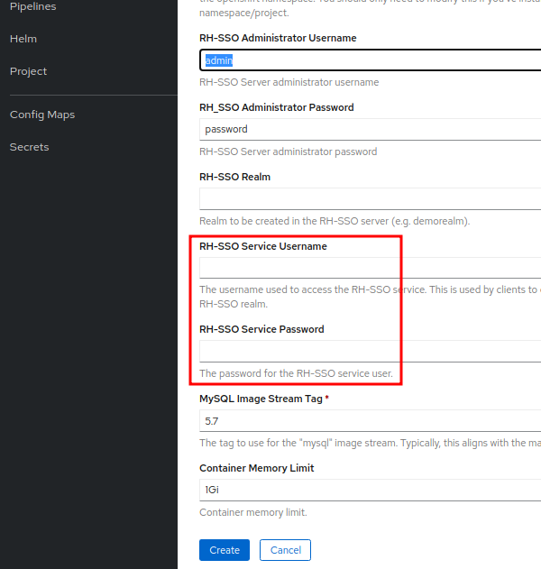

# Part 2 - Integration Red Hat Single Sign-On with OpenShift v4.x Container Platform
*Written by Kerem ÇELİKER*
- Linkedin: **`linkedin.com/in/keremceliker`**
- Twitter: **`@CloudRss`**
- Blog: **`www.keremceliker.com`**


  


In this article you will learn how Red Hat Sign-On Provides the ability to federate user accounts from multiple different user stores specifically from Ldap Server and External MySql user database. Many Organizations and Customers often have existing user stores that holds the information about the users and their credentials. 

Most often enterprise applications will have multiple different personals and user types using it with each user type coming from different user stores or even the more common scenario is that different applications would have user bases and the underlying user account management systems might be different for each of the applications.  

That's why to handle such scenarios typically each application layer will have to build a suitable authentication module and to handle the authorization against these different user account management systems.  

So most often results in a kind of redundant authentication modules getting built and it gets closely tied with each of these applications so RedHat Single Sign-On user Federation capabilities exactly addresses these concern and provides a unified way to federate different user account systems. 


- I have got Red Hat Openshift deployed inside of VMware vSphere Bare-Metal.  

- Im going to go ahead and create a sample project for SSO.

 
 
 - Let's go ahead and browse the catalog and locate the single sign-on template from Developer/Topology. 

 
 


 

- You will notice there's four different ones we're going to use the one with mysql with persistent storage. 

  


- I'm going to go ahead and instantiate the template but before we do that we will go ahead enter a username + password for the RH-SSO Administrator 

 

  

 

 

 

- We will switch back to administrator and will monitor the pod progress. We have got four pods and when two of them go into completed you know it's finished. 

 

 

 
 

 

- Now we can go ahead and look at the routes in the route location you will see exposed a url that I can go ahead by click. 

 

 

 

- Open the SSO Application on that url link from another tab within the browser we can click on the administration console. Now we can login in as the username and password that we supplied to the template. 

 

 

 

 

- We're going to go ahead to add a Realm. We will add a display name for it  and ll go ahead to add a user. For example; you ll call it test user or  whatever u want. 

 

 
 

 

  

- Now we can go ahead the create a client. We are going to set it for using the client protocol of OpenID Connect. One of the things we ll do is change it to confidential from public and we're going to give it a valid redirect url. 

 

 

 

 

- Now you will see a secret is applied we going to go ahead to use that later.  

 

- Now let's switch back to the openshift platform. Let's go to secrets and list "all-projects" because we re going to try and find the router. To go ahead copy the certificate value and to save it to a text file so we can use it later. 

 

 

 

 

- Let's go ahead create a IDP user and set the identity provider to open id connect. 

- We will specify the client id as openshift name and then we are gonna use the secret that was supplied in the sso application. 

 

 

  

 

- Just paste that in Client Secret from OpenID Connect Provider and give the issuer url to the sso apps. 

 

  
 

 

- We re going to set the CA file to that router certificate file that we copied. 

 

 

 

- At this point we can go ahead to got all the logins created we can go log-out from Openshift Container Platform. 

 

- Now we see to have another option to log-in the openshift with as the OpenID Connect  

 

 

 

  

 

- Finally, Voila ! You're logged in using the Single Sign-On to Openshift Container Platform !  

 

 

 

**Hope you Learned and Enjoyed !**

 
***Benefical Notes*** 

 You may get some errors when creating Pods for SSO. These will mostly be as follows: 

```
* Insufficient Memory 
* PullBackOff Error 
* Failed Scheduling 
* Read/Liveness Probe Issues
```

You can utterly resolve the above errors primarily by "Pod Debug" and by investigating the relevant circle-ish application links.

You may be getting these errors while pods wait too long in the "Pending" or "Creating Container" state. That's why it's important to run the following command to check and find out if you've received an error. 

**To Run under in SSO Project** if you are not using the **Multi-Tenant Container** structure. 
```
Oc describe pod "pod-name" 
```
**Sample Issue Image:**

 

